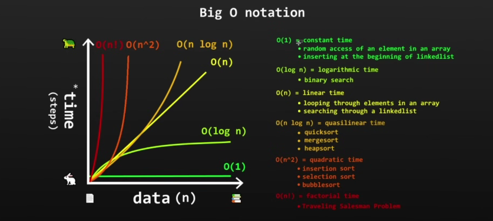
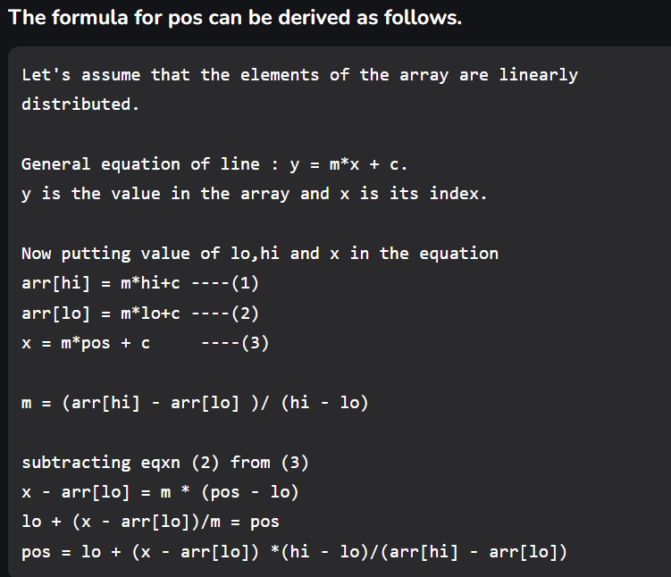
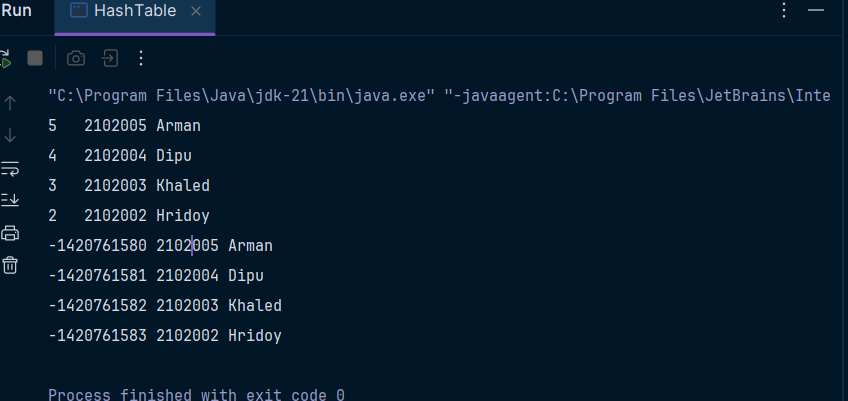

# Java_DSA_with_bro

> # Stack :

Stack = LIFO data Structure. Last-in First-Out
* Stores objects into a sort of "vertical tower"
* push() to add to the top
* pop() to remove from the top

```java
import java.util.Stack;

public class Main{
    public static void main(String[] args) {
        Stack<String> stack = new Stack<String>();
        System.out.println(stack.empty());
        
        stack.push("C");
        stack.push("C++");
        stack.push("Java");
        stack.push("Kotlin");

        System.out.println(stack.empty());
        System.out.println(stack);

        stack.pop();
        System.out.println(stack);
        stack.pop();
        System.out.println(stack);
        stack.pop();
        System.out.println(stack);
        

        //java.util.EmptyStackException     
                // stack.pop();
                // System.out.println(stack);
        
        //Jodi ekdom top element e jai ebong eta pop kori thokhn eta oi object return kore tai eta jodi amader dorkar hoi taile amra eta assign kore rakhbo...

        //String myFavLang = stack.pop();
        //System.out.println(myFavLang);

        //Kintu evabe korleo pop hoye stack khali hoye jai tai amra top dekhte peek() use kori...:

        System.out.println(stack.peek());


        //Kono kisu search korte hole :
        System.out.println(stack.search("Java"));//na thakle -1 return korbe...
        stack.push("C++");
        stack.push("Java");
        stack.push("Kotlin");
        System.out.println(stack.search("C"));//paile position return korbe...but ekhane top to bottom hisab kora lagbe ke age k pore...

        for(int i = 0; i < 10; i++){
            stack.push("Objective C");
        }

        
    }
}
```

### Uses of Stacks :
1. Undo/redo features in text-editors
2. Movig back/forward through browser history
3. Backtracking algorithms(maze, file directories)
4. Calling functions(call stack)


> # Queue :

Queue = FIFO data structure. First-In First-Out(ex- A line of people)
* A collection designed for holding elements prior to processing
* It's a linear data structure

```java
import java.util.LinkedList;
import java.util.Queue;

public class Main {
    public static void main(String[] args) {
    
    //It's an error to instantiate the queue because it's an Interface... Queue use korte Linkedlist or PriorityQueue er instance create korte hobe... karon egula diye implement Queue...
        //Queue<String> queue = new Queue<String>();

        Queue<String> queue = new LinkedList<String>();
        /*
         * add = enqueue, offer()
         * remove = dequeue, poll()
         */

         queue.offer("H");
         queue.offer("Hr");
         queue.offer("Hri");
         queue.offer("Hrid");
         queue.offer("Hrido");
         queue.offer("Hridoy");

         System.out.println(queue);
         System.out.println(queue.peek());

         queue.poll();
         System.out.println(queue.peek());

         //isEmpty():
         System.out.println(queue.isEmpty());
         //size();
         System.out.println(queue.size());
         //contains() return true of false:
         System.out.println(queue.contains("Hri"));

    }
}
```

## Where are queues useful?
1. Keyboard Buffer(letters should appear on the screen in the order they're pressed)
2. Printer Queue(Print jobs should be completed in order)
3. Used in Linkedlists, PriorityQueues, Breadth-first Search(BFS)...

> # Priority Queue :

Priority Queue = A FIFO data structure that serves elements with the highest priorities first before elements with lower priority.

```java
public static void main(String[] args) {
    //Ascending Order Normally :
        Queue<String> pQueue = new PriorityQueue<>();
    //Decending Order :
        Queue<String> pQueue2 = new PriorityQueue<>(Collections.reverseOrder());


        pQueue.offer("A");
        pQueue.offer("AB");
        pQueue.offer("ABC");
        pQueue.offer("ABCD");
        pQueue.offer("ABCDE");
        
        pQueue2.offer("A");
        pQueue2.offer("AB");
        pQueue2.offer("ABC");
        pQueue2.offer("ABCD");
        pQueue2.offer("ABCDE");

        while (!pQueue.isEmpty()) {
            System.out.println(pQueue.poll());
        }

        while (!pQueue2.isEmpty()) {
            System.out.println(pQueue2.poll());
        }
    }
```

> # LinkedLists(singly):
LinkedList = stores Nodes in 2 parts (data + address)

    >>Nodes are in non-consecutive memory locations
    >>Elements are linked using pointers

## Singly Linked List :
```java
/*
 *      Node                 Node                Node
 * [data | address] - > [data | address] -> [data | address]
 * 
*/
```

## Doubly Linked List : 
```java
/*
 *      Node                 Node                Node
 * [data | address] < - > [data | address] <-> [data | address]
 * 
*/
```

### Advantages :
1. Dynamic Data Structure (allocates needed while running)
2. Insertion and Deletion of Nodes is easy. O(1)
3. No/Low memory waste

### Disadvantages : 
1. Greater memory usage (additional pointer)
2. No random access of elements (no index[i])
3. Accessing / Searching elements is more time consuming. O(n)

### Uses :
1. Implement Stacks/Queues
2. GPS navigation
3. Music Playlist

```java
public static void main(String[] args) {
        LinkedList<String> linkedList = new LinkedList<String>();

        //Treating as Stack :
        System.out.println("LinkedList as Stack : ");
        linkedList.push("A");
        linkedList.push("B");
        linkedList.push("C");
        linkedList.push("D");

        System.out.println(linkedList);

        linkedList.pop();
        System.out.println(linkedList);

        //Treating as Queue : 
        LinkedList<String> linkedList2 = new LinkedList<String>();
        System.out.println("LinkedList as Queue : ");
        linkedList2.offer("A");
        linkedList2.offer("B");
        linkedList2.offer("C");
        linkedList2.offer("D");

        System.out.println(linkedList2);

        linkedList2.poll();

        System.out.println(linkedList2);

        //Adding and removing :
        linkedList2.add(2,"ABC");
        System.out.println(linkedList2);
        linkedList2.remove("ABC");
        System.out.println(linkedList2);

        //Searching :
        System.out.println(linkedList2.indexOf("B"));
        //peekFirst(), peekLast():
        System.out.println(linkedList2.peekFirst());
        System.out.println(linkedList2.peekLast());

        //addFirst(),addLast:
        linkedList2.addFirst("00");
        System.out.println(linkedList2);
        linkedList2.addLast("7");
        System.out.println(linkedList2);

        //removeFist(), removeLast();
        linkedList2.removeFirst();
        System.out.println(linkedList2);
        linkedList2.removeLast();
        System.out.println(linkedList2);
    }
```

> # Dynamic Array :
Advantages :
1. Random access of elements O(1)
2. Good locality of reference and data cache utilization
3. Easy to insert/delete at the end

Disadvantages :
1. Wastes more memory
2. Shifting elements is time-consuming O(n)
3. Expanding/Shrinking the array is time-consuming O(n)

```java
//Custom Dynamic Array Creation :
public class DynamicArray {
    int size;
    int capacity = 10;
    Object[] array;

    //Constructors :
    public DynamicArray() {
        this.array = new Object[capacity];
    }

    public DynamicArray(int capacity) {
        this.capacity = capacity;
        this.array = new Object[capacity];
    }

    //add function :
    public void add(Object data) {
        if(size >= capacity){
            grow();
        }
        array[size] = data;
        size++;
    }

    //insert function :
    public void insert(int index, Object data) {
        if(size >= capacity){
            grow();
        }
        for (int i = size; i > index; i--){
            array[i] = array[i - 1];
        }
        array[index] = data;
        size++;
    }

    //Delete function :
    public void delete(Object data) {
        for (int i = 0; i < size; i++){
            if(array[i] == data){
                for (int j = 0; j < (size - i - 1); j++){
                    array[i+j] = array[i+j+1];
                }
                array[size - 1] = null;
                size--;
                if(size <= (int) (capacity/3)){
                    shrink();
                }
                break;
            }
        }
    }
    //Search function :
    public int search(Object data){
        for(int i = 0; i < size ; i++){
            if(array[i] == data){
                return i;
            }
        }
        return -1;
    }

    //extend size of array :
    private void grow(){
        int newCapacity = (int) (capacity * 2);
        Object[] newArray = new Object[newCapacity];
        for (int i = 0; i < size; i++){
            newArray[i] = array[i];
        }
        capacity = newCapacity;
        array = newArray;
    }
    //shrink :
    private  void shrink(){
        int newCapacity = (int) (capacity / 2);
        Object[] newArray = new Object[newCapacity];
        for (int i = 0; i < size; i++){
            newArray[i] = array[i];
        }
        capacity = newCapacity;
        array = newArray;
    }
    //isEmpty():
    public boolean isEmpty(){
        return size == 0;
    }

    //toString();
    public String toString(){
        String string = "";
        for(int i = 0; i < capacity; i++){
            string += array[i] + ", ";
        }
        if(string != ""){
            string ="[" + string.substring(0, string.length() - 2) + "]";
        }else{
            string = "[]";
        }
        return string;
    }

}
```

LinkedList vs ArrayList : 
```java
LinkedList<Integer> linkedList = new LinkedList<Integer>();
        ArrayList<Integer> arrayList = new ArrayList<Integer>();

        long startTime;
        long endTime;
        long elapsedTime;

        for (int i = 0; i < 1000000; i++){
            linkedList.add(i);
            arrayList.add(i);
        }

        //LinkedList :
        startTime = System.nanoTime();
        //linkedList.get(0);
        //linkedList.get(500000);//it takes much time than 999999 because it's a doubly linked list...
        //linkedlist.get(999999);

        //linkedList.remove(0);
        //linkedList.remove(500000);
        linkedList.remove(999999);

        endTime = System.nanoTime();

        elapsedTime = endTime - startTime;
        System.out.println("Linkedlist :\t" + elapsedTime + " ns");
        //ArrayList :
        startTime = System.nanoTime();
        //arrayList.get(0);
        //arrayList.get(500000);
        //arrylist.get(999999);


       // arrayList.remove(0);
        //arrayList.remove(500000);
        arrayList.remove(999999);

        endTime = System.nanoTime();

        elapsedTime = endTime - startTime;
        System.out.println("Arraylist :\t" + elapsedTime + " ns");
```

> # Big O notaion :
> "How code slows as data grows."

1. Describes the performance of an algorithm as the amount of data increases
2. Machine independent(no of steps of completion)
3. Ignore smaller operations O(n + 1) -> O(n)

O(n) -> Linear time 
```java
int addU(int n){
    int sum = 0;
    for(int i = 0; i <= n; i++){
        sum += i;
    }
    return  sum;
}
```

O(1) -> Constant time 
```java
int addUp(int n){
    int sum = n * (n + 1) / 2;
    return  sum;
}
```


> # Searching : 

## Linear Search :
linear search = Iterate through a collection one element at a time
                runtime complexity : O(n)

Disadvantages : 
            Slow for large data sets

Advantages : 
            Fast for searches of small to medium data sets...
            Doesn't need to be sorted...
            Useful for data structures that don't have random access(Linked List)

```java
private static int linearSearch(int[] array, int value) {
        for (int i = 0; i < array.length; i++){
            if(array[i]==value){
                return i;
            }
        }
        return -1;
    }
```

## Binary Search :
Searching algorithm that finds the position of a target value within a sorted array. Half of the array is eliminated during each "step"---> O(logN)


```java
    private static int binarySearch(int[] array, int target) {
        int start = 0;
        int end = array.length - 1;
        while (start<=end){
            int mid = start + (end - start)/2;
            int value = array[mid];
            System.out.println("middle : " +mid);//step counting
            if(value<target) start = mid + 1;
            else if (value>target) end = mid - 1;
            else return  mid;//Found
        }
        return -1;//not found
    }
```

## Interpolation Search :
Interpolation search = improvement over binary search best used for "uniformly" distributed data "guesses" where a value might be based on calculated probe results if probe is incorrect, we narrow the search and try again...

Average case : O(log(log(n)))

Worst case : O(n)[values increase exponentially]

```java
    private static int interpolationSearch(int[] array, int target) {
        int start = 0;
        int end = array.length - 1;
        while (target >= array[start] && target <= array[end] && start <= end){
            int probe = start + (end - start) * (target - array[start])/(array[end] - array[start]);

            System.out.println("probe : " + probe);

            if(array[probe] == target){
                return probe;
            }
            else if(array[probe] < target){
                start = probe + 1;
            }else {
                end = probe - 1 ;
            }
        }
        return -1;
    }
```


> # Sorting Algorithm :

## Bubble sort:
Bubble sort = pairs of adjacent elements are compared, and the elements swapped if they are not in order.
1. Qradratic time O(n^2)
2. Small data set = okay-ish
3. Large data set = bad

```java
    private static void bubbleSort(int[] array) {
        for (int i = 0; i < array.length - 1; i++) {
            for (int j = 0; j < array.length - i - 1; j++) {
                if(array[j]>array[j+1]){
                    int temp = array[j];
                    array[j] = array[j+1];
                    array[j+1] = temp;
                }
            }
        }
    }
```

## Selection sort:
Selection sort = search through an array and keep track of the minimum value during each iteration. At the end of each iteration, we swap variables.

1. Quadratic time O(n^2)
2. Small data set = okay
3. Large data set = Bad

```java
    private static void selectionSort(int[] array) {
        for (int i = 0; i < array.length-1; i++) {
            int min = i;
            for (int j = i+1; j < array.length; j++) {
                if(array[j]<array[min]){
                    min = j;
                }
            }
            int temp = array[i];
            array[i] = array[min];
            array[min] = temp;
        }
    }
```

## Insertion Sort :
Insertion sort = after comparing elements to the left, shift elements to the right to make room to insert a value...

1. Quadratic time O(n^2)
2. Small data set = decent
3. large data set = BAD
4. Fewer steps than Bubble Sort
5. Best is O(n) compared to Selection Sort O(n^2

```java
    private static void insertionSort(int[] array) {
        for (int i = 1; i < array.length; i++) {
            int temp = array[i];
            int j = i-1;

            while (j>=0 && array[j] > temp){
                array[j+1] = array[j];
                j--;
            }
            array[j+1] = temp;
        }
    }
```

## Recursion :
Recursion = when a thing is defined in terms of itself.
* Apply the result of a procedure, to a procedure.
* A recursive method calls itself. Can be a substitute for iteration.
* Divide a problem into sub-problems of the same type as the original.
* Commonly used with advanced sorting algorithms and navigating trees.

Advantages :
1. Easier to read/write
2. Easier to debug

Disadvantages :
1. Sometimes slower
2. Use more memory

### Factorial :
```java
    private static int factorial(int i) {
        if(i<1) return 1;
        return i*factorial(i-1);
    }
```

### Power : 
```java
    private static int power(int base, int exponent) {
        if(exponent<1) return 1;//base case
        return base * power(base, exponent - 1);//recursive case
    }
```

## Merge sort :
Merge sort = recursively divide array in 2, sort, re-combine
* run-time complexity = O(nlog(n))
* space complexity = O(n)
```java
    private static void mergeSort(int[] array) {
        int length = array.length;
        if(length<=1) return;//baseCase

        int middle = length/2;
        int[] leftArray = new int[middle];
        int[] rightArray = new int[length-middle];

        for (int i = 0, j = 0; i < length; i++) {
            if (i<middle){
                leftArray[i] = array[i];
            }else{
                rightArray[j] = array[i];
                j++;
            }
        }

        mergeSort(leftArray);
        mergeSort(rightArray);
        merge(leftArray,rightArray,array);
    }

    private static void merge(int[] leftArray, int[] rightArray, int[] array) {
        int leftSize = leftArray.length;
        int rightSize = rightArray.length;

        int i = 0,l = 0,r = 0;

        while(l<leftSize && r<rightSize){
            if(leftArray[l]<rightArray[r]){
                array[i] = leftArray[l];
                i++;
                l++;
            }else{
                array[i] = rightArray[r];
                i++;
                r++;
            }
        }
        while(l<leftSize){
            array[i] = leftArray[l];
            i++;
            l++;
        }
        while (r<rightSize){
            array[i] = rightArray[r];
            i++;
            r++;
        }
    }
```

## Quick Sort :
Quick sort = moves smaller elements to  left of pivot.
* Recursively divide an array in 2 partitions
* Run-time complexity = Best case O(nlog(n))
* Worst case O(n^2) if already sorted
* Space complexity = O(log(n)) due to recursion


```java
    private static void quickSort(int[] array, int start, int end) {
        if(end<=start) return;//base case

        int pivot = partition(array,start,end);
        quickSort(array,start,pivot-1);
        quickSort(array,pivot+1,end);

    }

    private static int partition(int[] array, int start, int end) {
        int pivot = array[end];
        int i = start - 1;

        for(int j = start; j < end; j++){
            if(array[j]<pivot){
                i++;
                int temp = array[j];
                array[j] = array[i];
                array[i] = temp;
            }
        }
        i++;
        int temp = array[i];
        array[i] = array[end];
        array[end] = temp;
        return i;//that's the right pivot...
    }
```

> ## Hash Table :

Hashtable = A data structure that stores unique keys to values ex.<Integer, String>
* Each key/value pair is known as an Entry
* Fast insertion, look up, deletion of key/value pairs
* Not ideal for small data sets, great with large data sets
* Hashing = takes a key and computes an integer (formula will vary based on key and data type)
* In a Hashtable, we use the hash % capacity to calculate an index number
* key.hashCode() % capacity = index
* Bucket = an idexed storage location for one or more Entries...Can store multiple Entries in case of a collision(linked similarly a LinkedList)
* Collision = hash function generates the same index for more than one kew less collisions = more efficiency
* Runtime complexity :
1. Best case O(1)
2. Worst Case O(n)

```java
import java.util.Hashtable;

public class HashTable {
    public static void main(String[] args) {
        Hashtable<Integer, String> hashtable = new Hashtable<>(10);
        hashtable.put(2102002, "Hridoy");
        hashtable.put(2102003, "Khaled");
        hashtable.put(2102004, "Dipu");
        hashtable.put(2102005, "Arman");

        //hashtable.remove(2102004);
        for (Integer key : hashtable.keySet()) {
            System.out.println(key.hashCode() % 10 + "\t" + key + "\t" + hashtable.get(key));//key Integer type hoile hash hashCode hobe int type er...
        }
        Hashtable<String, String> hashtableS = new Hashtable<>(10);
        hashtableS.put("2102002", "Hridoy");
        hashtableS.put("2102003", "Khaled");
        hashtableS.put("2102004", "Dipu");
        hashtableS.put("2102005", "Arman");

        //hashtable.remove(2102004);
        for (String key : hashtableS.keySet()) {
            System.out.println(key.hashCode() + "\t" + key + "\t" + hashtableS.get(key));//String key er jonne oonno formula diye hashCode hobe...
        }
    }
}
```




